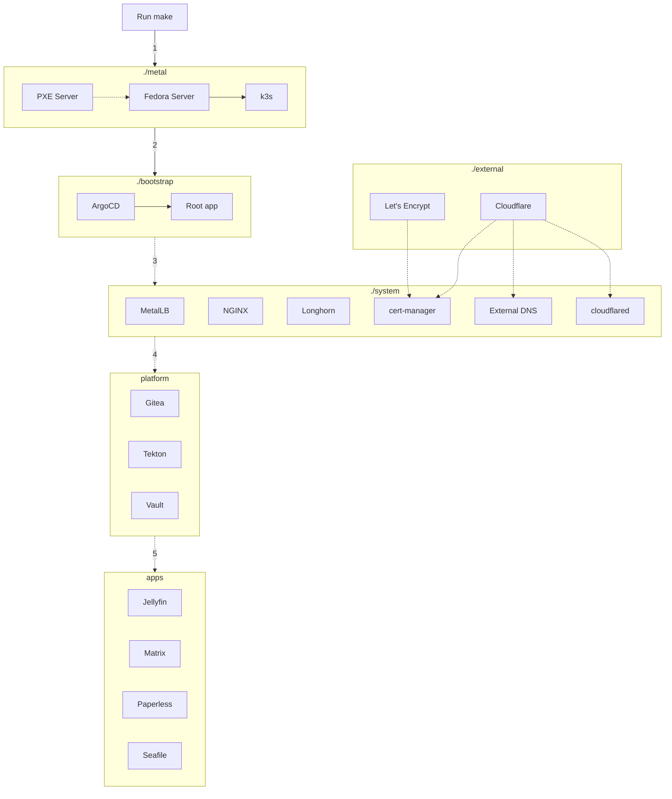

# Brayden's Homelab

[Images]
[image description]

# Components

- 2x [ROCK64 - 4GB](https://pine64.com/product/rock64-4gb-single-board-computer/)
  - 2x [ROCK64 PoE hats](https://pine64.com/product/rock64-quartz64-model-b-poe-add-on-board/)
- 1x Raspberry Pi 4B - 4GB
  - [UCTRONICS PoE hat](https://www.uctronics.com/tools-and-accessories/pi-accessories/uctronics-poe-hat-ieee-5v-2-5a-mini-power-over-ethernet-expansion-board.html)
- 3x Cheap SSDs - 1TB & 2x 512GB
  - [Buy on Amazon](https://a.co/d/hlKWpGv)
- [TP-Link 5 Port Gigabit PoE Switch - TL-SG1005P](https://www.tp-link.com/ca/business-networking/unmanaged-switch/tl-sg1005p/v4/)
  - [Buy on Amazon](https://a.co/d/33y9pDA)
- [TP-Link AC750 Wireless Travel Router - TL-WR902AC](https://www.tp-link.com/ca/home-networking/wifi-router/tl-wr902ac/)
  - [Buy on Amazon](https://a.co/d/cZdRKha)
- [C4Labs Cloudlet Cluster Case](https://www.c4labs.com/product/cloudlet-cluster-case-raspberry-pi/)

# Preface

Preface with I have no idea what I'm doing

Good luck finding a raspberry pi. You can try rpilocator, but for the price; ROCK64 or alternative boards are hands-down the way to go.
And that is assuming you want this thing for the novelty like I do. It would likely be a lot smarter to just get some mini assembled PCs.

<Add case issues and pains here>

You may want to check the power draw if you use all four PoE ports of the switch with USB peripherals.
The TP-Link switch is PoE+ (802.3at). It says it supports up to 30 W for each PoE port, with a total maximum of up to 65 W for all 4 PoE ports.
Unfortunately all the PoE hats I found use the 802.3af standard. Which only guarantees up to about 13W

<Thank Khuedan>

How my project differs high-level and link to architecture
In the future maybe I'll comeback and see if I can get PXE booting to work, but not sure I see the value given how fun it is to setup the OS and SSDs by hand.

# Architecture

## Tech stack

<table>
  <tr>
      <th>Logo</th>
      <th>Name</th>
      <th>Description</th>
  </tr>
  <tr>
        <td>
        <svg xmlns="http://www.w3.org/2000/svg" width="32" fill="none" viewBox="0 0 144 144"><path fill="#7B42BC" fill-rule="evenodd" d="m55.522 32.97 32.96 19.02v38.06l-32.96-19.03V32.97ZM92.09 51.99v38.06l32.95-19.03V32.97L92.09 51.99ZM18.96 11.73v38.05l32.95 19.03V30.76L18.96 11.73ZM55.522 113.24l32.95 19.03V94.22l-32.95-19.03v38.05Z" clip-rule="evenodd"></path></svg></td>
        <td><a href="https://www.terraform.io/">Terraform</a></td>
        <td>Automate, provision and manage infrastructure in any cloud</td>
    </tr>
</table>

## Overview

```
+--------------+
|    ./apps    |
|--------------|
|  ./platform  |
|--------------|       +------------+
|   ./system   |- - - -| ./external |
|--------------|       +------------+
| ./bootstrap  |
|--------------|
|   ./metal    |
|--------------|
|   HARDWARE   |
+--------------+
```

Main components:

- `./metal`: bare metal management, install Linux and Kubernetes
- `./bootstrap`: GitOps bootstrap with ArgoCD
- `./system`: critical system components for the cluster (load balancer, storage, ingress, operation tools...)
- `./platform`: essential components for service hosting platform (vault, git...)
- `./apps`: user facing applications
- `./external` (optional): externally managed services (cloudflare DNS/Tunnel, ZeroTier VPN, Terraform Cloud)

Support components:

- `./tools`: tools container, includes all the tools you'll need
- `./docs`: all documentation go here, this will generate a searchable web UI
- `./scripts`: scripts to automate common tasks

## Provisioning flow

<details>
Everything will eventually be automated. After you edit the configuration files, you just need to run a single `make` command and it will:

- (1) Build the `./metal` layer:
  - Create an ephemeral, stateless PXE server
  - Install Linux on all servers in parallel
  - Build a Kubernetes cluster (based on k3s)
- (2) Build the `./bootstrap` layer:
  - Install ArgoCD
  - Configure the root app to manage other layers (and also manage itself)

From now on, ArgoCD will do the rest:

- (3) Build the `./system` layer (storage, networking, monitoring, etc)
- (4) Build the `./platform` layer (Gitea, Vault, SSO, etc)
- (5) Build the `./apps` layer: (Syncthing, Jellyfin, etc)



Below is the pseudo code for the entire process, you don't have to read it right now, but it will be handy for debugging.

??? detailed "Detailed provisioning flow"

    ```
    Human run make:
        build ./metal:
            install the OS:
                    install the OS based on the init config:
                        configure the system
                        remaining files required to install
                    reboot to the new OS
                controller see the machines are ready
            build a Kubernetes cluster:
                download k3s binary
                generate cluster token
                copy k3s config files
                enable k3s service and form a cluster
                create KUBECONFIG file
                create MetalLB config:
                    use the last /27 subnet of the network
                    apply the config
        build ./bootstrap:
            install ArgoCD:
                apply helm chart
                wait for status
            install root app:
                select values file:
                    if Gitea unreachable (first install):
                        get data from GitHub
                    else:
                        get data from Gitea
                apply helm chart
                wait for status
    ArgoCD apply the rest:
        clone git repo
        install components based on directories:
            ./bootstrap (it manages itself):
                argocd
                root
            ./system:
                storage
                loadbalancer
                ingress
                etc
            ./platform (depends on ./system):
                git:
                    migrate the homelab repository from GitHub
                    ArgoCD switch the source from GitHub to Gitea
                ci
                vault
                etc
            ./apps (depends on ./system and ./platform):
                homepage
                jellyfin
                etc
    ```

</details>

# Getting Started

## Metal

### Prerequisites

- Setup devices.
  - See [docs/metal/rock64.md](docs/metal/rock64.md) or [docs/metal/rpi.md](docs/metal/rpi.md)
- Format SSDs
  - See [docs/metal/storage.md](docs/metal/storage.md)

You'll need the following installed:

- [Terraform](https://developer.hashicorp.com/terraform/downloads)
- [Packer](https://developer.hashicorp.com/packer/downloads)
- [Ansible](https://docs.ansible.com/ansible/latest/installation_guide/intro_installation.html)

Would recommend to use brew over python to install Ansible

```
brew install ansible
```

Generate an ssh-key with `./scripts/ssh-keygen.sh`

Ansible Inventory can be found in `/metal/inventory.yaml`

### Resources

[Ansible Getting Started Docs](https://docs.ansible.com/ansible/latest/getting_started/index.html)

# Rough Notes

https://www.reddit.com/r/homelab/wiki/introduction/
https://github.com/mikeroyal/Self-Hosting-Guide

## Look into

- Terraform
- Ansible
- rke https://registry.terraform.io/providers/rancher/rke/latest
- traefik
- portainer

- tailscale
- Cloud flare tunnel
- Wireguard
- Openvpn

- Apache Guacamole
- Qbittorrent
- Speedflux

## apps

- Secret management
  - Vaultwarden
- Storage
  - Nextcloud https://nextcloud.com/
  - myDrive https://github.com/subnub/myDrive
- Media server
  - jellyfin, emby
- Media server management
  - sonarr - manage & download TV shows
  - radarr - manage & download movies
  - overseerr/Ombi - request content for media server
  - Prowlarr
  - requestrr
  - tautulli - monitor plex
- Monitoring
  - grafana
  - prometheus
  - healthchecks.io / Uptime kuma

## system

## infra

## To Install

- K3s
- Pihole https://github.com/pi-hole/pi-hole

## Ideas

- Dashboard
- Media vault
- Display my apple to do list
- Scrape events from city website, filters for low - capacity, time, type
- CI/CD
  Homepage with Ingress discovery powered by [Hajimari](https://github.com/toboshii/hajimari)
